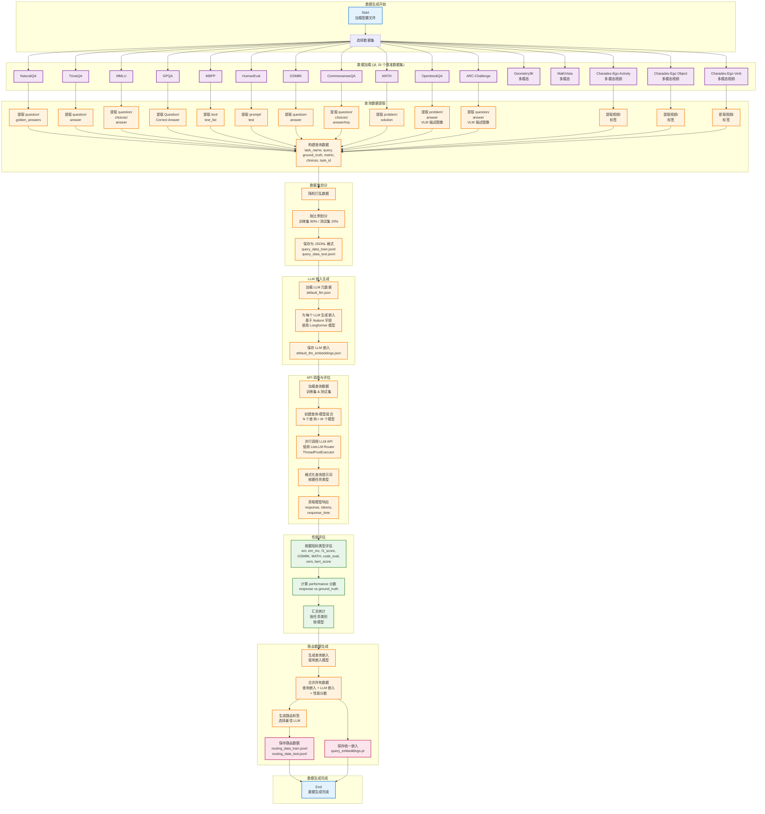

# LLMRouter 数据生成流程图

## 流程说明

数据生成流程将原始基准数据集转换为路由器训练所需的格式化数据。

## 关键步骤说明

### 1. 数据加载
从 16 个不同的基准数据集加载原始数据：
- **文本任务**: NaturalQA, TriviaQA, MMLU, GPQA, CommonsenseQA, OpenbookQA, ARC-Challenge
- **数学任务**: GSM8K, MATH
- **代码任务**: MBPP, HumanEval
- **多模态任务**: Geometry3K, MathVista, Charades-Ego (Activity/Object/Verb)

### 2. 查询数据提取
统一数据格式，提取以下字段：
- `task_name`: 任务类型
- `query`: 查询文本（对于多模态任务，包含 VLM 生成的图像描述）
- `ground_truth`: 标准答案
- `metric`: 评估指标类型
- `choices`: 选择题选项（如适用）
- `task_id`: 任务唯一标识

### 3. 数据集划分
随机打乱数据，按 80/20 比例划分为训练集和测试集。

### 4. LLM 嵌入生成
为每个 LLM 候选生成嵌入向量：
- 基于 `feature` 字段（LLM 特征描述）
- 使用 Longformer 模型生成嵌入
- 保存为 JSON 格式

### 5. API 调用与评估
对每个查询调用所有候选 LLM：
- 使用 LiteLLM Router 管理多模型调用
- 支持并行处理（ThreadPoolExecutor）
- 根据任务类型格式化提示词
- 记录响应、token 数、响应时间

### 6. 性能评估
根据不同的评估指标计算性能分数：
- **EM/EM_MC**: 精确匹配（普通/多选题）
- **F1 Score**: F1 分数
- **GSM8K**: 数学题评估
- **MATH**: 数学题 LaTeX 格式评估
- **Code Eval**: 代码执行评估（HumanEval/MBPP）
- **CEM**: 字符级精确匹配
- **BERT Score**: 语义相似度

### 7. 路由数据生成
生成最终的路由训练数据：
- 生成查询嵌入向量
- 合并所有数据（查询嵌入、LLM 嵌入、性能分数）
- 选择性能最佳的 LLM 作为路由标签
- 保存为 JSONL 格式

## 输出文件

- `query_data_train.jsonl`: 训练集查询数据
- `query_data_test.jsonl`: 测试集查询数据
- `default_llm_embeddings.json`: LLM 嵌入数据
- `query_embeddings.pt`: 查询嵌入向量
- `routing_data_train.jsonl`: 训练集路由数据
- `routing_data_test.jsonl`: 测试集路由数据