# LLMRouter 核心模块依赖关系图

本文档提供了 LLMRouter 项目的核心模块依赖关系图，展示了 llmrouter 包内部各模块的依赖关系、路由器类继承关系、训练器类继承关系以及第三方库依赖关系。

## 目录
- [llmrouter 包模块依赖图](#llmrouter-包模块依赖图)
- [路由器类继承关系图](#路由器类继承关系图)
- [训练器类继承关系图](#训练器类继承关系图)
- [第三方库依赖关系图](#第三方库依赖关系图)

---

## llmrouter 包模块依赖图

以下图表展示了 llmrouter 包内部各模块之间的依赖关系：

```mermaid
graph TB
    subgraph LLMRouter包
        ROOT[llmrouter/__init__.py]
        CLI[llmrouter/cli/]
        DATA[llmrouter/data/]
        EVAL[llmrouter/evaluation/]
        MODELS[llmrouter/models/]
        PROMPTS[llmrouter/prompts/]
        SERVE[llmrouter/serve/]
        UTILS[llmrouter/utils/]
        PLUGIN[plugin_system.py]
    end

    subgraph CLI模块
        CLI_INIT[cli/__init__.py]
        CLI_CHAT[cli/router_chat.py]
        CLI_INF[cli/router_inference.py]
        CLI_TRAIN[cli/router_train.py]
    end

    subgraph DATA模块
        DATA_INIT[data/__init__.py]
        DATA_MAIN[data/data.py]
        DATA_LOAD[data/data_loader.py]
        DATA_GEN[data/data_generation.py]
        DATA_EMB[data/generate_llm_embeddings.py]
        DATA_MM[data/multimodal_generation.py]
        DATA_API[data/api_calling_evaluation.py]
    end

    subgraph EVAL模块
        EVAL_INIT[evaluation/__init__.py]
        EVAL_BATCH[evaluation/batch_evaluator.py]
        EVAL_EX[evaluation/example.py]
    end

    subgraph MODELS模块
        MODELS_INIT[models/__init__.py]
        META_ROUTER[models/meta_router.py]
        BASE_TRAINER[models/base_trainer.py]
        KNN[models/knnrouter/]
        SVM[models/svmrouter/]
        MLP[models/mlprouter/]
        MF[models/mfrouter/]
        ELO[models/elorouter/]
        DC[models/routerdc/]
        AUTO[models/automix/]
        HYBRID[models/hybrid_llm/]
        GRAPH[models/graphrouter/]
        CAUSAL[models/causallm_router/]
        R1[models/router_r1/]
        GMT[models/gmtrouter/]
        PERSON[models/personalizedrouter/]
        SMALLEST[models/smallest_llm/]
        LARGEST[models/largest_llm/]
        KNN_MR[models/knnmultiroundrouter/]
        LLM_MR[models/llmmultiroundrouter/]
    end

    subgraph UTILS模块
        UTILS_INIT[utils/__init__.py]
        UTILS_API[utils/api_calling.py]
        UTILS_CONV[utils/conversation.py]
        UTILS_DATA[utils/data_loader.py]
        UTILS_DF[utils/dataframe_utils.py]
        UTILS_EMB[utils/embeddings.py]
        UTILS_EVAL[utils/evaluation.py]
        UTILS_LOAD[utils/model_loader.py]
        UTILS_PROC[utils/data_processing.py]
        UTILS_PROMPT[utils/prompting.py]
        UTILS_SETUP[utils/setup.py]
        UTILS_TENSOR[utils/tensor_utils.py]
        UTILS_ARENA[utils/arena_conversation.py]
        UTILS_HELP[utils/router_helpers.py]
        UTILS_PROGRESS[utils/progress.py]
        UTILS_CONST[utils/constants.py]
        UTILS_CONV_DATA[utils/data_convert.py]
    end

    subgraph SERVE模块
        SERVE_INIT[serve/__init__.py]
        SERVE_CFG[serve/config.py]
        SERVE_SRV[serve/server.py]
    end

    subgraph PROMPTS模块
        PROMPTS_INIT[prompts/__init__.py]
    end

    %% 依赖关系
    CLI --> MODELS
    CLI --> DATA
    CLI --> EVAL
    CLI --> UTILS
    CLI --> SERVE

    DATA --> UTILS
    DATA --> PROMPTS

    EVAL --> UTILS

    MODELS --> DATA
    MODELS --> UTILS
    MODELS --> EVAL

    SERVE --> MODELS
    SERVE --> UTILS

    UTILS --> PROMPTS

    CLI_TRAIN --> UTILS_LOAD
    CLI_TRAIN --> UTILS_EMB
    CLI_TRAIN --> UTILS_EVAL

    %% CLI 子模块依赖
    CLI_CHAT --> MODELS
    CLI_CHAT --> UTILS
    CLI_INF --> MODELS
    CLI_INF --> EVAL
    CLI_INF --> UTILS

    %% DATA 子模块依赖
    DATA_GEN --> UTILS
    DATA_GEN --> DATA_LOAD
    DATA_EMB --> UTILS
    DATA_EMB --> DATA_LOAD
    DATA_MM --> UTILS
    DATA_API --> UTILS
    DATA_API --> DATA_LOAD
    DATA_API --> UTILS_EVAL

    %% MODELS 子模块依赖
    KNN --> UTILS
    KNN --> DATA
    SVM --> UTILS
    MLP --> UTILS
    MF --> UTILS
    ELO --> UTILS
    DC --> UTILS
    AUTO --> UTILS
    AUTO --> DATA
    HYBRID --> UTILS
    GRAPH --> UTILS
    CAUSAL --> UTILS
    R1 --> UTILS
    GMT --> UTILS
    GMT --> DATA
    PERSON --> UTILS
    SMALLEST --> UTILS
    LARGEST --> UTILS
    KNN_MR --> UTILS
    LLM_MR --> UTILS

    %% UTILS 内部依赖
    UTILS_EVAL --> UTILS_PROMPT
    UTILS_PROC --> UTILS_EMB
    UTILS_CONV_DATA --> UTILS
    UTILS_CONV_DATA --> DATA

    %% SERVE 内部依赖
    SERVE_SRV --> SERVE_CFG

    ROOT -.-> CLI
    ROOT -.-> DATA
    ROOT -.-> EVAL
    ROOT -.-> MODELS
    ROOT -.-> PROMPTS
    ROOT -.-> SERVE
    ROOT -.-> UTILS
    ROOT -.-> PLUGIN
```



---

## 路由器类继承关系图

以下图表展示了所有路由器类的继承关系，根类为 `MetaRouter`：

```mermaid
classDiagram
    %% 基础类
    class MetaRouter {
        <<abstract>>
        +nn.Module model
        +Any resources
        +dict cfg
        +list metric_weights
        +route_batch(batch) Any
        +route_single(batch) Any
        +forward(batch) Any
        +compute_metrics(outputs, batch) dict
        +save_router(path)
        +load_router(path)
    }

    class PyTorch_nn_Module {
        <<external>>
        torch.nn.Module
    }

    class Python_ABC {
        <<external>>
        abc.ABC
    }

    %% 继承关系
    MetaRouter --|> PyTorch_nn_Module : 继承
    MetaRouter --|> Python_ABC : 继承

    %% 路由器子类
    class SmallestLLM {
        +route_single(batch) dict
        +route_batch(batch) list
    }

    class LargestLLM {
        +route_single(batch) dict
        +route_batch(batch) list
    }

    class KNNRouter {
        -KNeighborsClassifier knn_model
        -list query_embedding_list
        -list model_name_list
        +route_single(query) dict
        +route_batch(batch, task_name) list
    }

    class SVMRouter {
        +route_single(batch) Any
        +route_batch(batch) Any
    }

    class MLPRouter {
        +route_single(batch) Any
        +route_batch(batch) Any
    }

    class MFRouter {
        +route_single(batch) Any
        +route_batch(batch) Any
    }

    class EloRouter {
        +route_single(batch) Any
        +route_batch(batch) Any
    }

    class DCRouter {
        +route_single(batch) Any
        +route_batch(batch) Any
    }

    class AutomixRouter {
        +route_single(batch) Any
        +route_batch(batch) Any
    }

    class HybridLLMRouter {
        +route_single(batch) Any
        +route_batch(batch) Any
    }

    class GraphRouter {
        <<optional>>
        +route_single(batch) Any
        +route_batch(batch) Any
    }

    class CausalLMRouter {
        <<optional>>
        +route_single(batch) Any
        +route_batch(batch) Any
    }

    class RouterR1 {
        <<optional>>
        +route_single(batch) Any
        +route_batch(batch) Any
    }

    class GMTRouter {
        <<optional>>
        +route_single(batch) Any
        +route_batch(batch) Any
    }

    class PersonalizedRouter {
        <<optional>>
        +route_single(batch) Any
        +route_batch(batch) Any
    }

    class KNNMultiRoundRouter {
        +route_single(batch) Any
        +route_batch(batch) Any
    }

    class LLMMultiRoundRouter {
        +route_single(batch) Any
        +route_batch(batch) Any
    }

    %% 继承关系
    SmallestLLM --|> MetaRouter : 继承
    LargestLLM --|> MetaRouter : 继承
    KNNRouter --|> MetaRouter : 继承
    SVMRouter --|> MetaRouter : 继承
    MLPRouter --|> MetaRouter : 继承
    MFRouter --|> MetaRouter : 继承
    EloRouter --|> MetaRouter : 继承
    DCRouter --|> MetaRouter : 继承
    AutomixRouter --|> MetaRouter : 继承
    HybridLLMRouter --|> MetaRouter : 继承
    GraphRouter --|> MetaRouter : 继承
    CausalLMRouter --|> MetaRouter : 继承
    RouterR1 --|> MetaRouter : 继承
    GMTRouter --|> MetaRouter : 继承
    PersonalizedRouter --|> MetaRouter : 继承
    KNNMultiRoundRouter --|> MetaRouter : 继承
    LLMMultiRoundRouter --|> MetaRouter : 继承

    note for MetaRouter "所有路由器的抽象基类\n继承自 nn.Module 和 ABC"
    note for GraphRouter "可选依赖（需要 torch-geometric）"
    note for CausalLMRouter "可选依赖"
    note for RouterR1 "可选依赖（需要 vllm）"
    note for GMTRouter "可选依赖"
    note for PersonalizedRouter "可选依赖（需要 torch-geometric）"
```



---

## 训练器类继承关系图

以下图表展示了所有训练器类的继承关系，根类为 `BaseTrainer`：

```mermaid
classDiagram
    %% 基础类
    class BaseTrainer {
        <<abstract>>
        +torch.nn.Module router
        +torch.optim.Optimizer optimizer
        +str device
        +dict kwargs
        +loss_func(outputs, batch) torch.Tensor
        +train(dataloader) None
    }

    class Python_ABC {
        <<external>>
        abc.ABC
    }

    %% 继承关系
    BaseTrainer --|> Python_ABC : 继承

    %% 训练器子类
    class KNNRouterTrainer {
        -KNeighborsClassifier model
        -list query_embedding_list
        -list model_name_list
        +train()
    }

    class SVMRouterTrainer {
        +loss_func(outputs, batch)
        +train(dataloader)
    }

    class MLPTrainer {
        +loss_func(outputs, batch)
        +train(dataloader)
    }

    class MFRouterTrainer {
        +loss_func(outputs, batch)
        +train(dataloader)
    }

    class EloRouterTrainer {
        +loss_func(outputs, batch)
        +train(dataloader)
    }

    class DCTrainer {
        +loss_func(outputs, batch)
        +train(dataloader)
    }

    class AutomixRouterTrainer {
        +loss_func(outputs, batch)
        +train(dataloader)
    }

    class HybridLLMTrainer {
        +loss_func(outputs, batch)
        +train(dataloader)
    }

    class GraphTrainer {
        <<optional>>
        +loss_func(outputs, batch)
        +train(dataloader)
    }

    class CausalLMTrainer {
        <<optional>>
        +loss_func(outputs, batch)
        +train(dataloader)
    }

    class GMTRouterTrainer {
        <<optional>>
        +loss_func(outputs, batch)
        +train(dataloader)
    }

    class PersonalizedRouterTrainer {
        <<optional>>
        +loss_func(outputs, batch)
        +train(dataloader)
    }

    class KNNMultiRoundRouterTrainer {
        +loss_func(outputs, batch)
        +train(dataloader)
    }

    %% 继承关系
    KNNRouterTrainer --|> BaseTrainer : 继承
    SVMRouterTrainer --|> BaseTrainer : 继承
    MLPTrainer --|> BaseTrainer : 继承
    MFRouterTrainer --|> BaseTrainer : 继承
    EloRouterTrainer --|> BaseTrainer : 继承
    DCTrainer --|> BaseTrainer : 继承
    AutomixRouterTrainer --|> BaseTrainer : 继承
    HybridLLMTrainer --|> BaseTrainer : 继承
    GraphTrainer --|> BaseTrainer : 继承
    CausalLMTrainer --|> BaseTrainer : 继承
    GMTRouterTrainer --|> BaseTrainer : 继承
    PersonalizedRouterTrainer --|> BaseTrainer : 继承
    KNNMultiRoundRouterTrainer --|> BaseTrainer : 继承

    note for BaseTrainer "所有训练器的抽象基类\n继承自 ABC"
    note for GraphTrainer "可选依赖（需要 torch-geometric）"
    note for CausalLMTrainer "可选依赖"
    note for GMTRouterTrainer "可选依赖"
    note for PersonalizedRouterTrainer "可选依赖（需要 torch-geometric）"
```



---

## 第三方库依赖关系图

以下图表展示了 LLMRouter 项目的第三方库依赖关系：

```mermaid
graph TB
    subgraph 核心依赖
        TORCH[torch>=2.0]
        TRANSFORMERS[transformers>=4.40]
        NUMPY[numpy>=1.21]
        PANDAS[pandas>=1.5]
        YAML[pyyaml>=6.0]
    end

    subgraph 数据处理依赖
        SCIKIT[scikit-learn>=1.2]
        DATASETS[datasets>=2.14]
        SENTENCEPIECE[sentencepiece>=0.1.99]
    end

    subgraph 网络与服务依赖
        FASTAPI[fastapi]
        UVICORN[uvicorn]
        WEBSOCKETS[websockets]
        HTTPX[httpx]
        LITELLM[litellm>=1.0]
    end

    subgraph 评估依赖
        SCIPY[scipy>=1.10]
        PROTOBUF[protobuf>=3.20]
    end

    subgraph 可选依赖
        VLLM[vllm==0.6.3]
        OPENAI[openai>=1.0]
        TORCH_GEOMETRIC[torch-geometric>=2.3]
        GRADIO[gradio>=4.0]
        PEFT[peft>=0.7]
        PYDANTIC[pydantic>=2.0]
    end

    subgraph 标准库
        OS[os]
        SYS[sys]
        JSON[json]
        PICKLE[pickle]
        COPY[copy]
        RANDOM[random]
        TIME[time]
        THREADING[threading]
        RE[re]
        STRING[string]
        BASE64[base64]
        IO[io]
        AST[ast]
        ARGPARSE[argparse]
        GC[gc]
        CONCURRENT_FUTURES[concurrent.futures]
    end

    subgraph LLMRouter模块
        MODELS[models/]
        DATA[data/]
        UTILS[utils/]
        CLI[cli/]
        EVAL[evaluation/]
        SERVE[serve/]
    end

    %% 依赖关系
    TORCH --> MODELS
    TORCH --> UTILS

    TRANSFORMERS --> UTILS
    TRANSFORMERS --> DATA

    NUMPY --> UTILS
    NUMPY --> DATA
    NUMPY --> EVAL

    PANDAS --> DATA
    PANDAS --> UTILS

    YAML --> MODELS
    YAML --> PROMPTS[prompts/]

    SCIKIT --> MODELS
    SCIKIT --> UTILS

    DATASETS --> DATA

    SENTENCEPIECE --> TRANSFORMERS

    FASTAPI --> SERVE
    UVICORN --> SERVE
    WEBSOCKETS --> SERVE
    HTTPX --> UTILS
    LITELLM --> UTILS

    SCIPY --> EVAL
    PROTOBUF --> TORCH

    VLLM --> MODELS
    OPENAI --> UTILS
    TORCH_GEOMETRIC --> MODELS
    GRADIO --> CLI
    PEFT --> MODELS
    PYDANTIC --> SERVE

    OS --> CLI
    OS --> DATA
    OS --> MODELS
    OS --> SERVE
    OS --> UTILS

    SYS --> CLI
    SYS --> DATA
    SYS --> SERVE

    JSON --> DATA
    JSON --> UTILS
    JSON --> SERVE

    PICKLE --> UTILS
    PICKLE --> MODELS

    COPY --> MODELS

    RANDOM --> DATA

    TIME --> SERVE
    TIME --> UTILS

    THREADING --> UTILS

    RE --> EVAL
    RE --> UTILS

    STRING --> EVAL

    BASE64 --> DATA

    IO --> DATA

    AST --> UTILS

    ARGPARSE --> CLI
    ARGPARSE --> DATA

    GC --> MODELS

    CONCURRENT_FUTURES --> DATA
    CONCURRENT_FUTURES --> UTILS

    %% 模块间依赖
    MODELS --> TORCH
    MODELS --> NUMPY
    MODELS --> SCIKIT
    MODELS --> PYDANTIC
    MODELS --> TORCH_GEOMETRIC

    DATA --> TORCH
    DATA --> PANDAS
    DATA --> NUMPY
    DATA --> YAML
    DATA --> DATASETS

    UTILS --> TORCH
    UTILS --> NUMPY
    UTILS --> PANDAS
    UTILS --> SCIKIT
    UTILS --> TRANSFORMERS
    UTILS --> LITELLM
    UTILS --> OPENAI

    EVAL --> NUMPY
    EVAL --> SCIPY

    SERVE --> FASTAPI
    SERVE --> UVICORN
    SERVE --> PYDANTIC

    CLI --> GRADIO

    note for TORCH "PyTorch 深度学习框架"
    note for TRANSFORMERS "Hugging Face Transformers"
    note for VLLM "RouterR1 可选依赖"
    note for TORCH_GEOMETRIC "GraphRouter 和 PersonalizedRouter 可选依赖"
```

---

## 附录：第三方依赖版本要求

### 核心依赖（必需）
| 包名 | 最低版本 | 用途 |
|------|----------|------|
| torch | 2.0 | 深度学习框架 |
| transformers | 4.40 | Hugging Face 模型库 |
| numpy | 1.21 | 数值计算 |
| pandas | 1.5 | 数据处理 |
| scikit-learn | 1.2 | 机器学习工具 |
| pyyaml | 6.0 | YAML 配置解析 |
| datasets | 2.14 | Hugging Face 数据集 |
| sentencepiece | 0.1.99 | 分词器 |
| tqdm | 4.65 | 进度条 |
| pydantic | 2.0 | 数据验证 |
| gradio | 4.0 | Web UI |
| litellm | 1.0 | LLM API 调用 |
| peft | 0.7 | 参数高效微调 |
| torch-geometric | 2.3 | 图神经网络（可选） |
| scipy | 1.10 | 科学计算 |
| protobuf | 3.20 | Protocol Buffers |
| fastapi | - | Web 服务框架 |
| uvicorn | - | ASGI 服务器 |
| websockets | - | WebSocket 支持 |
| httpx | - | 异步 HTTP 客户端 |

### 可选依赖
| 包名 | 版本 | 用途 |
|------|------|------|
| vllm | 0.6.3 | RouterR1 高性能推理 |
| openai | 1.0 | OpenAI API 客户端 |

---

## 总结

LLMRouter 项目采用了清晰的模块化架构：

1. **模块依赖关系**：核心模块（models、data、utils、evaluation、serve、cli）之间有明确的依赖层次，避免了循环依赖。

2. **路由器继承体系**：所有路由器都继承自 `MetaRouter` 抽象基类，该基类提供了统一的接口规范，包括 `route_batch()` 和 `route_single()` 抽象方法。

3. **训练器继承体系**：所有训练器都继承自 `BaseTrainer` 抽象基类，该基类定义了训练器的通用接口，包括 `loss_func()` 和 `train()` 抽象方法。

4. **第三方库依赖**：项目依赖多个成熟的第三方库，包括 PyTorch、Transformers、scikit-learn 等，确保了代码的可靠性和可维护性。部分路由器（如 GraphRouter、RouterR1）有可选依赖。

5. **可扩展性**：通过抽象基类和插件系统，用户可以方便地添加新的路由器和训练器实现。

该依赖图为理解 LLMRouter 的架构和扩展新功能提供了清晰的参考。