# LLMRouter 推理流程图

## 流程说明

推理流程处理用户请求，通过路由决策选择最佳 LLM，并返回响应结果。

```mermaid
graph TB
    subgraph Start["推理开始"]
        A[Start<br/>用户发送请求] --> B[接收请求<br/>API / WebSocket / CLI]
    end

    subgraph RequestParsing["请求解析"]
        B --> C1[解析请求格式<br/>ChatRequest 模型]
        C1 --> C2[提取消息列表<br/>messages: role, content]
        C2 --> C3[提取参数<br/>model, temperature,<br/>max_tokens, stream]
    end

    subgraph QueryExtraction["查询提取"]
        C3 --> D1[从消息中提取<br/>用户查询]
        D1 --> D2[反向遍历 messages<br/>查找 role=user]
        D2 --> D3[截取查询文本<br/>前 500 字符]
        D3 --> D4[构建完整上下文<br/>包含对话历史]
    end

    subgraph RouterLoading["路由器加载"]
        D4 --> E1[RouterAdapter 初始化<br/>router_name, config_path]
        E1 --> E2{路由器已加载?}
        E2 -->|否| E3[动态加载路由器<br/>importlib.import_module]
        E2 -->|是| E4[使用已加载路由器]
        E3 --> E5[实例化路由器类<br/>继承 MetaRouter]
        E5 --> E6[验证路由器接口<br/>route_single 存在]
        E6 --> E4
    end

    subgraph RoutingDecision["路由决策"]
        E4 --> F1[获取可用模型列表<br/>available_models]
        F1 --> F2{模型参数指定?}
        F2 -->|是| F3[使用指定模型<br/>request.model]
        F2 -->|否| F4[路由决策<br/>router.route_single]
        F4 --> F5[输入: 查询嵌入<br/>+ LLM 嵌入]
        F5 --> F6[路由器推理<br/>相似度计算 / 分类]
        F6 --> F7[输出: model_name<br/>或 predicted_llm]
        F7 --> F8{模型可用?}
        F8 -->|是| F9[使用选定模型]
        F8 -->|否| F10[模糊匹配<br/>名称相似度]
        F10 --> F11{匹配成功?}
        F11 -->|是| F9
        F11 -->|否| F12[回退到默认模型<br/>available_models 0]
    end

    subgraph LLMBackend["LLM 后端调用"]
        F3 --> G1[LLMBackend 初始化<br/>ServeConfig]
        F9 --> G1
        F12 --> G1
        G1 --> G2[查找 LLM 配置<br/>llm_config = config.llms model]
        G2 --> G3[获取 API 密钥<br/>llm_config.api_key<br/>or config.get_api_key]
        G3 --> G4{流式模式?}
        G4 -->|是| G5[流式调用<br/>async _call_streaming]
        G4 -->|否| G6[同步调用<br/>async _call_sync]
    end

    subgraph SyncCall["同步调用"]
        G6 --> H1[构建请求体<br/>model, messages,<br/>max_tokens, temperature]
        H1 --> H2[设置请求头<br/>Content-Type,<br/>Authorization]
        H2 --> H3[发送 HTTP POST 请求<br/>httpx.AsyncClient]
        H3 --> H4{响应状态 OK?}
        H4 -->|否| H5[抛出 HTTPException<br/>status_code, detail]
        H4 -->|是| H6[解析响应 JSON<br/>choices message content]
        H6 --> H7[添加模型前缀<br/>if show_model_prefix]
        H7 --> H8[返回响应<br/>result.model = selected_model]
    end

    subgraph StreamCall["流式调用"]
        G5 --> I1[构建请求体<br/>model, messages,<br/>max_tokens, stream=True]
        I1 --> I2[设置请求头<br/>Content-Type,<br/>Authorization]
        I2 --> I3[创建流式请求<br/>httpx.stream POST]
        I3 --> I4{响应状态 OK?}
        I4 -->|否| I5[返回错误数据块<br/>data: error]
        I4 -->|是| I6[异步读取流<br/>async for line in resp.aiter_lines]
        I6 --> I7{数据块格式?}
        I7 -->|data: | I8[处理 SSE 数据<br/>Server-Sent Events]
        I8 --> I9[添加模型前缀<br/>if show_model_prefix<br/>首个内容块]
        I9 --> I10[生成数据块<br/>yield chunk]
        I6 --> I11{流结束?}
        I11 -->|否| I7
        I11 -->|是| I12[流式响应完成]
    end

    subgraph WebSocket["WebSocket 推理"]
        B --> J1[WebSocket 连接建立<br/>/v1/chat/ws]
        J1 --> J2[接收 JSON 请求<br/>await websocket.receive_json]
        J2 --> J3[解析 ChatRequest]
        J3 --> J4[提取用户查询]
        J4 --> J5[路由决策<br/>router.route]
        J5 --> J6[调用 LLM 后端<br/>stream=True]
        J6 --> J7[异步读取流数据<br/>async for chunk]
        J7 --> J8[处理数据块<br/>发送 JSON 或 text]
        J8 --> J9[通过 WebSocket<br/>await websocket.send_json/send_text]
        J9 --> J10[处理异常<br/>WebSocketDisconnect / Error]
        J10 --> J11[关闭连接<br/>await websocket.close]
    end

    subgraph ResponseFormat["响应格式"]
        H8 --> K1[OpenAI 兼容格式<br/>choices message content]
        I12 --> K2[流式 SSE 格式<br/>data: choices delta content]
        K1 --> K3[添加模型信息<br/>model 字段]
        K2 --> K4[添加模型前缀<br/>model_name prefix]
        K3 --> K5[返回给用户]
        K4 --> K5
    end

    subgraph Logging["日志记录"]
        F5 --> L1[记录路由决策<br/>Query -> Model]
        H6 --> L2[记录响应时间]
        I8 --> L3[记录流式数据块]
        L1 --> L4[汇总统计<br/>成功/失败率]
        L2 --> L4
        L3 --> L4
    end

    subgraph End["推理完成"]
        K5 --> M[End<br/>返回响应给用户]
        J11 --> M
    end

    %% 样式定义
    classDef startEnd fill:#e3f2fd,stroke:#1976d2,stroke-width:2px
    classDef parsing fill:#f3e5f5,stroke:#7b1fa2,stroke-width:2px
    classDef routing fill:#fff3e0,stroke:#f57c00,stroke-width:2px
    classDef llmCall fill:#e8f5e9,stroke:#388e3c,stroke-width:2px
    classDef stream fill:#e0f7fa,stroke:#0097a7,stroke-width:2px
    classDef ws fill:#fce4ec,stroke:#c2185b,stroke-width:2px
    classDef response fill:#f1f8e9,stroke:#689f38,stroke-width:2px

    class A,M startEnd
    class B,C1,C2,C3,D1,D2,D3,D4 parsing
    class E1,E2,E3,E4,E5,E6,F1,F2,F3,F4,F5,F6,F7,F8,F9,F10,F11,F12 routing
    class G1,G2,G3,G4,H1,H2,H3,H4,H5,H6,H7,H8 llmCall
    class I1,I2,I3,I4,I5,I6,I7,I8,I9,I10,I11,I12 stream
    class J1,J2,J3,J4,J5,J6,J7,J8,J9,J10,J11 ws
    class K1,K2,K3,K4,K5 response
    class L1,L2,L3,L4 fill:#eeeeee,stroke:#757575,stroke-width:1px
```

## 关键步骤说明

### 1. 请求解析
解析用户请求：
- **API 端点**: `/v1/chat/completions`（REST API）
- **WebSocket 端点**: `/v1/chat/ws`（实时流式通信）
- **CLI 工具**: 命令行交互接口

### 2. 查询提取
从消息列表中提取用户查询：
- 反向遍历消息，找到最后一条用户消息
- 截取前 500 字符作为查询
- 保留完整的对话历史作为上下文

### 3. 路由器加载
动态加载指定的路由器：
- 支持自定义路由器（`custom_routers/`）
- 验证路由器接口（必须实现 `route_single`）
- 缓存已加载的路由器

### 4. 路由决策
选择最佳 LLM：
- **指定模型**: 如果用户指定了模型，直接使用
- **自动路由**: 调用路由器 `route_single()` 进行决策
- **回退机制**: 模型不可用时进行模糊匹配或使用默认模型

### 5. LLM 后端调用
调用选定的 LLM：
- 支持多种 LLM 提供商（NVIDIA, OpenAI, Anthropic 等）
- 支持 OpenAI 兼容端点（vLLM, SGLang, Ollama）
- 支持流式和非流式两种调用模式

### 6. 响应格式化
返回 OpenAI 兼容格式的响应：
- 添加模型前缀（可选）
- 保持 OpenAI API 兼容性
- 支持流式 SSE 格式

### 7. 日志记录
记录推理过程的关键信息：
- 路由决策日志（查询 -> 模型）
- 响应时间统计
- 成功/失败率统计

## 支持的推理接口

| 接口类型 | 端点 | 说明 |
|---------|------|------|
| REST API | `/v1/chat/completions` | OpenAI 兼容的 HTTP API |
| WebSocket | `/v1/chat/ws` | 实时流式通信 |
| CLI | `llmrouter chat` | 命令行交互界面 |
| FastAPI | `/health`, `/v1/models` | 健康检查和模型列表 |

## 路由策略

| 策略 | 说明 | 触发条件 |
|------|------|---------|
| 自动路由 | 使用路由器决策 | model="auto" |
| 指定模型 | 使用用户指定的模型 | model 有效值 |
| 模糊匹配 | 按名称相似度匹配 | 指定模型不可用 |
| 默认回退 | 使用第一个可用模型 | 所有策略失败 |

## 响应特性

- **OpenAI 兼容**: 完全兼容 OpenAI Chat Completions API
- **流式支持**: 支持 SSE 流式响应
- **模型前缀**: 可选添加模型名称前缀
- **错误处理**: 完善的错误处理和回退机制