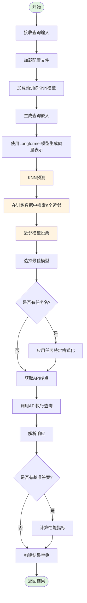
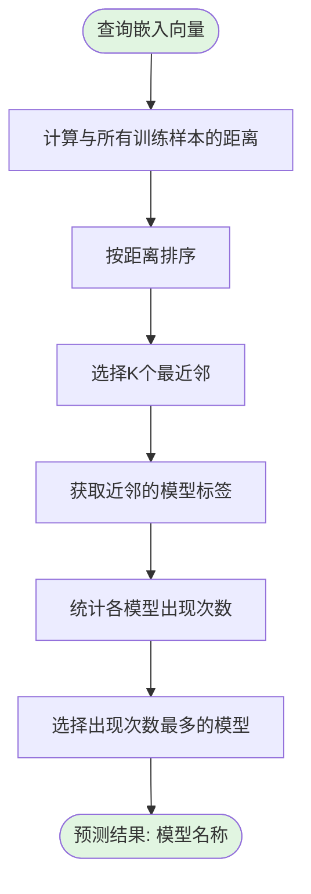

# KNN Router 路由流程图

## 流程概述

KNN Router 使用 K-近邻（K-Nearest Neighbors）分类器根据查询嵌入选择最合适的语言模型。

## 详细流程图

## 子流程：KNN 预测详情

## 数据流说明

1. **输入**: 查询文本（query）
2. **嵌入生成**: 使用 Longformer 模型将文本转换为固定维度的向量
3. **KNN 搜索**: 在训练数据嵌入中查找最相似的 K 个样本
4. **投票决策**: 基于近邻样本的模型标签进行多数投票
5. **输出**: 路由的模型名称 + API 执行结果

## 关键参数

| 参数 | 说明 | 默认值 |
|------|------|--------|
| n_neighbors | K近邻数量 | 2 |
| metric | 距离度量方式 | cosine |
| algorithm | 搜索算法 | auto |

## 依赖关系

- `Longformer`: 用于生成查询嵌入
- `sklearn.neighbors.KNeighborsClassifier`: KNN 分类器
- `llm_data.json`: 模型配置数据
- `call_api`: API 调用工具函数