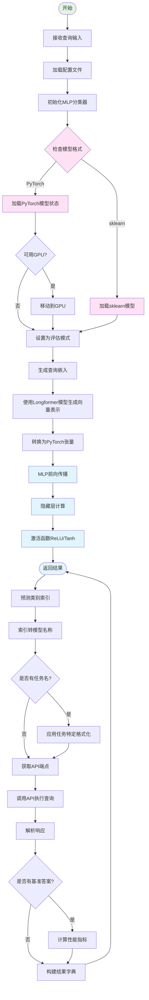
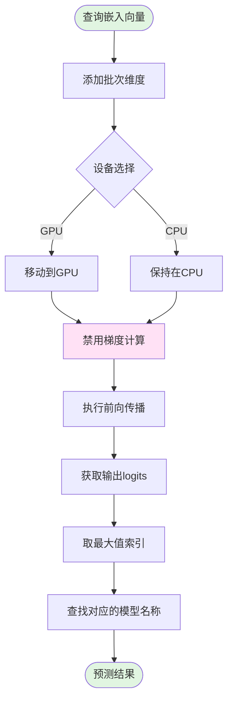

# MLP Router 路由流程图

## 流程概述

MLP Router 使用多层感知机（Multi-Layer Perceptron）神经网络根据查询嵌入选择最合适的语言模型。现在支持 PyTorch 实现以利用 GPU 加速。

## 详细流程图

## 子流程：MLP 网络结构

## 子流程：模型推理

## 数据流说明

1. **输入**: 查询文本（query）
2. **嵌入生成**: 使用 Longformer 模型将文本转换为固定维度的向量
3. **张量转换**: 将 NumPy 数组转换为 PyTorch 张量
4. **MLP 推理**: 通过多层神经网络计算类别概率
5. **输出解析**: 将类别索引映射回模型名称
6. **最终输出**: 路由的模型名称 + API 执行结果

## 关键参数

| 参数 | 说明 | 默认值 |
|------|------|--------|
| hidden_layer_sizes | 隐藏层尺寸列表 | [128, 64] |
| activation | 激活函数 | relu |
| lr | 学习率 | 0.001 |
| epochs | 训练轮数 | 100 |
| batch_size | 批次大小 | 32 |
| alpha | L2正则化系数 | 0.0001 |

## 激活函数选项

- `relu`: ReLU (默认)
- `tanh`: 双曲正切
- `logistic`: Sigmoid
- `identity`: 线性激活

## 依赖关系

- `Longformer`: 用于生成查询嵌入
- `PyTorch`: MLP 神经网络实现
- `llm_data.json`: 模型配置数据
- `call_api`: API 调用工具函数
- `load_model`: 模型加载工具函数

## 模型兼容性

MLPRouter 支持两种模型格式：
1. **PyTorch 模型** (新格式): 支持 GPU 加速，推荐使用
2. **sklearn 模型** (旧格式): 向后兼容，仅 CPU

格式自动检测，无需手动配置。