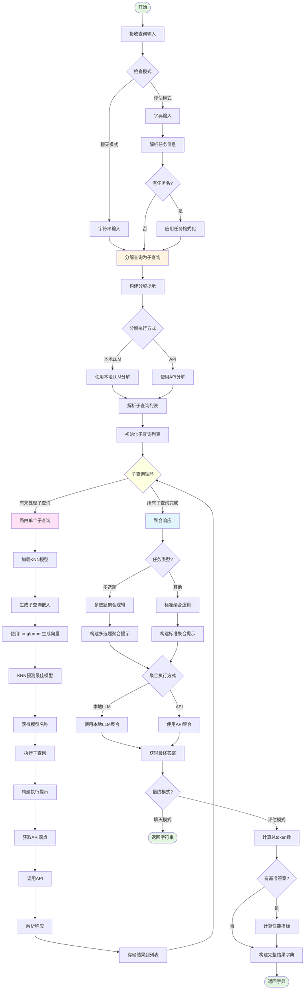
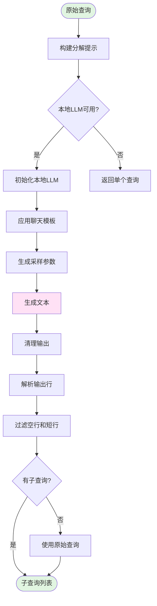
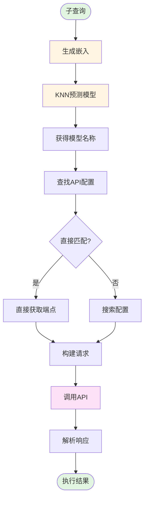
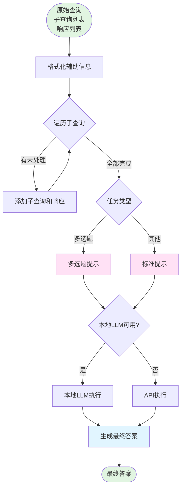

# MultiRound Router 多轮路由流程图

## 流程概述

MultiRound Router 专为复杂的多轮对话场景设计，通过查询分解 → 子查询路由 → 独立执行 → 结果聚合的流水线处理复杂查询。每个子查询独立路由到最适合的模型。

## 详细流程图

## 子流程：查询分解

## 子流程：子查询路由与执行

## 子流程：响应聚合

## 数据流说明

1. **输入阶段**:
   - 支持字符串（聊天模式）和字典（评估模式）两种输入
   - 可选任务格式化（如 MMLU、GSM8K 等）

2. **分解阶段**:
   - 使用本地 LLM 或 API 将复杂查询分解为多个子查询
   - 如果分解失败，回退到原始查询

3. **路由阶段**（对每个子查询）:
   - 使用 KNN 算法独立路由每个子查询
   - 每个子查询可能被路由到不同的模型

4. **执行阶段**（对每个子查询）:
   - 使用特定任务的 Agent Prompt
   - 调用路由模型的 API 获取响应

5. **聚合阶段**:
   - 根据任务类型选择聚合策略
   - 多选题任务使用特定的格式和规则
   - 其他任务使用标准的 COT（Chain of Thought）聚合

6. **输出阶段**:
   - 聊天模式：仅返回最终答案字符串
   - 评估模式：返回包含 token 统计和性能指标的完整字典

## 支持的多选题任务

以下任务使用多选题聚合逻辑：
- `commonsense_qa`
- `openbook_qa`
- `arc_challenge`
- `mmlu`
- `gpqa`

## 关键参数

| 参数 | 说明 | 默认值 |
|------|------|--------|
| base_model | 用于分解和聚合的基座模型 | Qwen/Qwen2.5-3B-Instruct |
| use_local_llm | 是否使用本地LLM | false |
| knn_model_path | KNN模型路径 | - |
| n_neighbors | K近邻数量 | 5 |
| metric | 距离度量 | cosine |

## 依赖关系

- `Longformer`: 用于生成查询嵌入
- `KNeighborsClassifier`: KNN 分类器
- `vllm`: 本地 LLM 推理（可选）
- `llm_data.json`: 模型配置数据
- `call_api`: API 调用工具函数
- `load_prompt_template`: 提示模板加载器

## 提示模板

路由器使用三种主要提示模板：
1. **agent_decomp**: 查询分解提示
2. **agent_prompt**: 子查询执行提示
3. **agent_decomp_cot**: 标准 COT 聚合提示

多选题聚合使用内置的特定提示格式。