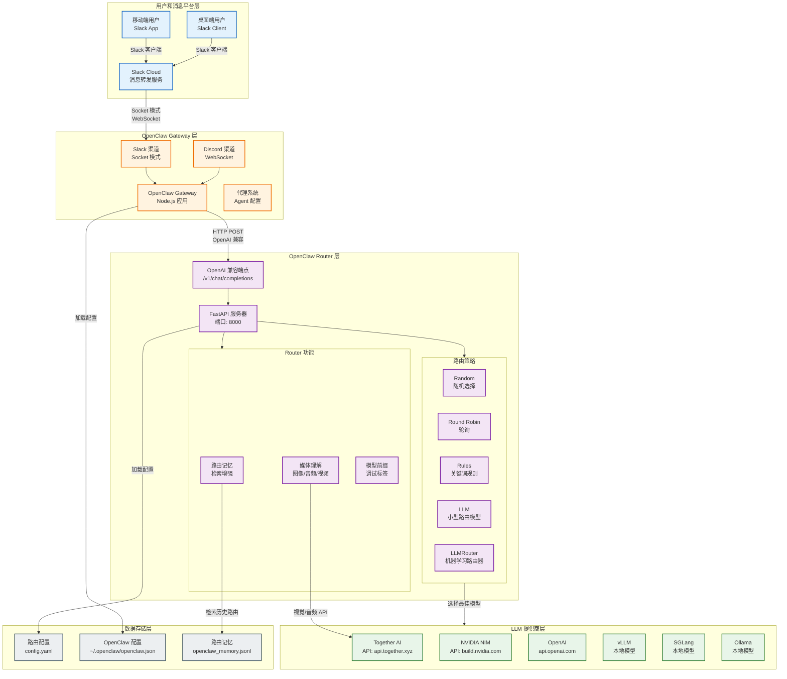
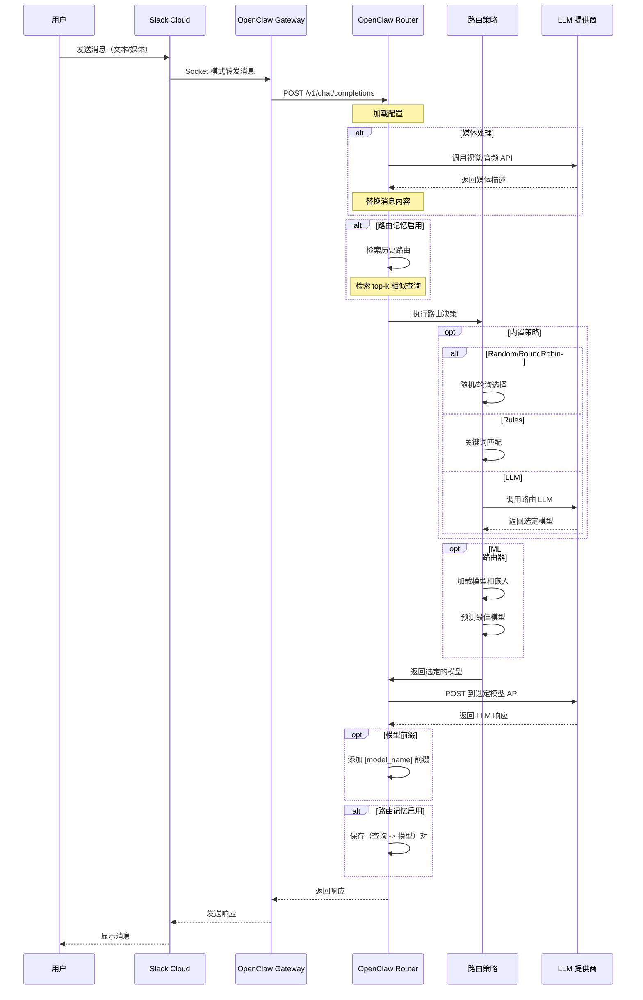
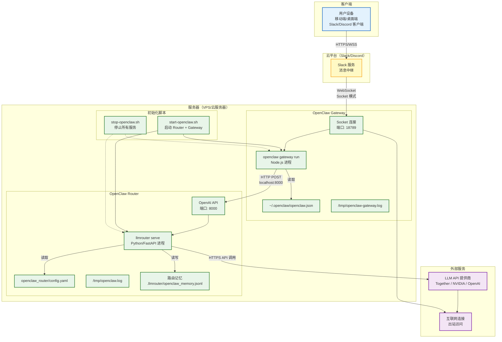
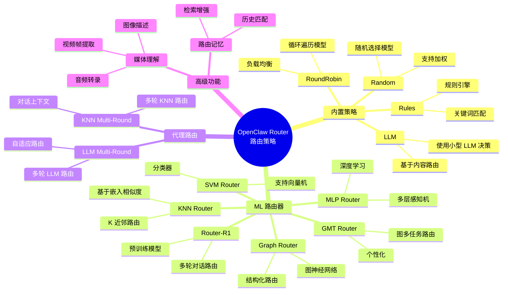
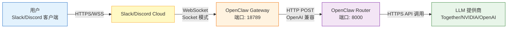

# OpenClaw 集成架构图

## 1. 完整集成架构（Slack + OpenClaw Gateway + Router）



## 2. 请求流向详解



## 3. 部署架构（生产环境）



## 4. 路由策略分类



## 5. 组件关系详解

### OpenClaw Gateway 与 Router 的关系

| 组件 | 技术 | 端口 | 协议 | 职责 |
|------|------|------|------|------|
| OpenClaw Gateway | Node.js | 18789 | WebSocket (Slack) + HTTP | 消息平台与 LLM API 之间的桥梁 |
| OpenClaw Router | Python/FastAPI | 8000 | HTTP (OpenAI 兼容) | 智能路由请求到最佳 LLM |

**通信方式**：
- Gateway 通过 HTTP POST 调用 Router 的 `/v1/chat/completions` 端点
- 请求格式兼容 OpenAI Chat Completions API
- Router 返回标准的 OpenAI 响应格式

### 请求处理流程

1. **用户发送消息** → Slack/Discord 客户端
2. **消息平台转发** → OpenClaw Gateway（Socket 模式）
3. **Gateway 处理** → 调用 OpenClaw Router API
4. **Router 路由** → 根据策略选择最佳 LLM
5. **LLM 生成** → 调用上游 API 获取响应
6. **响应返回** → Gateway → 消息平台 → 用户

### 配置文件关系

1. **`openclaw_router/config.yaml`**：
   - 控制 Router 的行为
   - 定义后端 LLM 池
   - 配置路由策略
   - 存储 API 密钥

2. **`~/.openclaw/openclaw.json`**：
   - 配置 OpenClaw Gateway
   - 定义如何调用 Router（baseUrl, apiKey）
   - 配置 Slack/Discord 集成
   - 设置代理默认模型

## 6. 网络拓扑



**网络要求**：
- **出站访问**：服务器需要访问 Slack/Discord 和 LLM API 提供商
- **入站访问**：无需公共入站端口（Socket 模式通过 WebSocket 连接）
- **内部通信**：Gateway 和 Router 通常运行在同一服务器上，使用 localhost 通信

## 7. 部署选项

### 开发环境
```
┌─────────────────────────────────────────────────┐
│  本地开发机                                     │
│  ┌─────────────────────────────────────────┐   │
│  │ OpenClaw Gateway (18789)              │   │
│  │ OpenClaw Router (8000)                │   │
│  └─────────────────────────────────────────┘   │
└─────────────────────────────────────────────────┘
         │                    │
         ↓                    ↓
┌─────────────────┐  ┌─────────────────┐
│ Slack/Discord   │  │ LLM API 提供商  │
└─────────────────┘  └─────────────────┘
```

### 生产环境（单服务器）
```
┌─────────────────────────────────────────────────┐
│  VPS / 云服务器                                 │
│  ┌─────────────────────────────────────────┐   │
│  │ OpenClaw Gateway (系统服务)           │   │
│  │ OpenClaw Router (系统服务)            │   │
│  │ 健康检查监控                           │   │
│  │ 日志轮转                               │   │
│  └─────────────────────────────────────────┘   │
└─────────────────────────────────────────────────┘
         │                    │
         ↓                    ↓
┌─────────────────┐  ┌─────────────────┐
│ Slack/Discord   │  │ LLM API 提供商  │
└─────────────────┘  └─────────────────┘
```

### 生产环境（分布式）
```
┌──────────────────┐  ┌──────────────────┐
│ Gateway 服务器   │  │ Router 服务器    │
│ OpenClaw GW      │  │ OpenClaw Router  │
│ 端口: 18789      │  │ 端口: 8000       │
└──────────────────┘  └──────────────────┘
         │                    │
         └────────┬───────────┘
                  ↓
    ┌────────────────────────┐
    │   负载均衡 / API 网关  │
    └────────────────────────┘
                  │
                  ↓
    ┌────────────────────────┐
    │   LLM API 提供商       │
    └────────────────────────┘
```

## 8. 安全架构

```mermaid
graph TB
    subgraph SecurityLayers["安全层"]
        L1["消息平台认证<br/>Slack/Discord OAuth"]
        L2["Gateway 模式<br/>local 模式限制"]
        L3["API 密钥隔离<br/>上游密钥在服务器"]
        L4["配对批准<br/>手动 approve"]
    end

    subgraph DataProtection["数据保护"]
        D1["API 密钥<br/>环境变量"]
        D2["配置文件<br/>用户目录权限"]
        D3["日志文件<br/>受限访问"]
    end

    subgraph NetworkSecurity["网络安全"]
        N1["Socket 模式<br/>无需公共端口"]
        N2["出站连接<br/>API 白名单"]
        N3["本地通信<br/>localhost"]
    end

    L1 --> L2 --> L3 --> L4
    D1 --> D2 --> D3
    N1 --> N2 --> N3

    style SecurityLayers fill:#ffebee,stroke:#c62828
    style DataProtection fill:#e8eaf6,stroke:#283593
    style NetworkSecurity fill:#e0f2f1,stroke:#00695c
```



**安全特性**：
1. **API 密钥隔离**：上游 LLM API 密钥存储在服务器（Router），不暴露给客户端
2. **Socket 模式**：无需公共入站 Webhook URL，降低攻击面
3. **配对批准**：首次访问需要手动 approve
4. **环境变量**：敏感信息通过环境变量传递

## 总结

OpenClaw 集成架构提供了完整的消息平台到 LLM 的解决方案：

- **用户友好**：Slack/Discord 原生体验，无需自定义 UI
- **灵活路由**：支持多种路由策略和 ML 路由器
- **部署简单**：单脚本启动，支持 systemd 服务
- **安全可靠**：API 密钥隔离，Socket 模式，配对批准
- **易于扩展**：支持自定义路由器、本地模型、多提供商