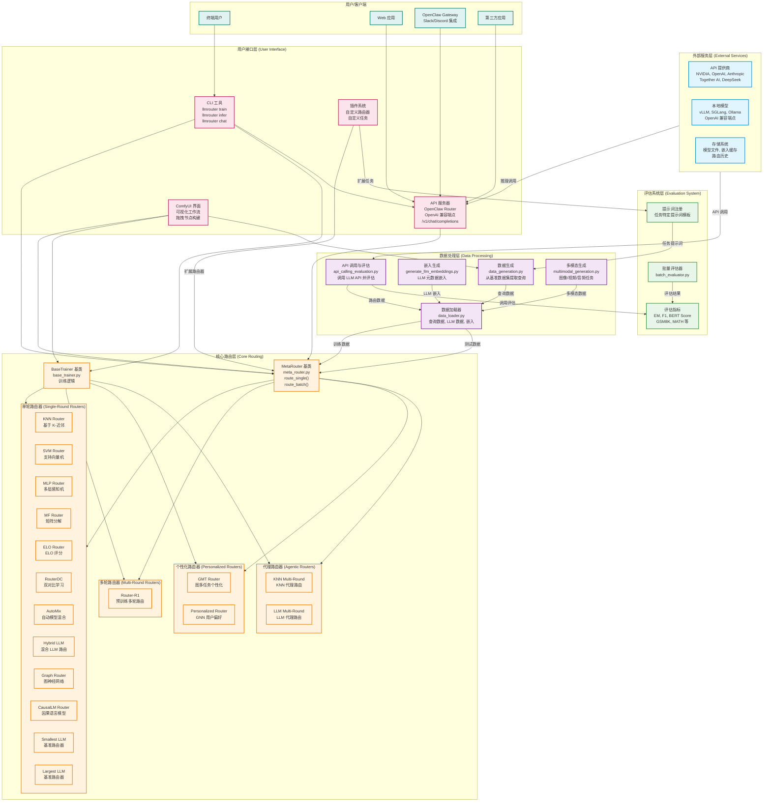

# LLMRouter 系统整体架构图

## 架构说明

### 1. 用户接口层 (User Interface Layer)

LLMRouter 提供多种用户交互方式：

- **CLI 工具**：统一命令行接口，支持训练、推理和聊天
  - `llmrouter train` - 训练路由器
  - `llmrouter infer` - 执行推理
  - `llmrouter chat` - 交互式聊天界面
  - `llmrouter serve` - 启动 API 服务器

- **API 服务器**：OpenAI 兼容的 REST API
  - 端点：`/v1/chat/completions`
  - 支持 OpenClaw Gateway 集成
  - 可与 Slack、Discord 等平台集成

- **ComfyUI 界面**：可视化工作流构建
  - 拖拽节点构建数据生成和路由流水线
  - 实时监控训练和推理状态
  - 模块化设计，支持自定义节点

- **插件系统**：支持自定义扩展
  - 自定义路由器（`custom_routers/`）
  - 自定义任务（`custom_tasks/`）

### 2. 核心路由层 (Core Routing Layer)

核心路由层包含所有路由器实现：

#### MetaRouter 基类
- 提供统一的路由接口：`route_single()` 和 `route_batch()`
- 配置和数据加载
- 模型保存/加载功能

#### 路由器分类

**单轮路由器 (Single-Round Routers)**
- KNN Router - K-近邻路由
- SVM Router - 支持向量机
- MLP Router - 多层感知机
- MF Router - 矩阵分解
- ELO Router - ELO 评分
- RouterDC - 双对比学习
- AutoMix - 自动模型混合
- Hybrid LLM - 混合 LLM 路由
- Graph Router - 图神经网络
- CausalLM Router - 因果语言模型
- Smallest LLM / Largest LLM - 基准路由器

**多轮路由器 (Multi-Round Routers)**
- Router-R1 - 预训练多轮对话路由

**个性化路由器 (Personalized Routers)**
- GMT Router - 图多任务个性化路由
- Personalized Router - GNN 用户偏好建模

**代理路由器 (Agentic Routers)**
- KNN Multi-Round - KNN 代理路由
- LLM Multi-Round - LLM 代理路由

### 3. 数据处理层 (Data Processing Layer)

负责数据的生成、处理和加载：

- **数据生成** (`data_generation.py`)：从 11 个基准数据集提取查询
- **嵌入生成** (`generate_llm_embeddings.py`)：生成 LLM 元数据嵌入
- **API 调用与评估** (`api_calling_evaluation.py`)：调用 LLM API 并评估响应
- **数据加载器** (`data_loader.py`)：统一加载查询数据、LLM 数据、嵌入
- **多模态生成** (`multimodal_generation.py`)：支持图像/视频/音频任务

### 4. 评估系统层 (Evaluation System Layer)

提供灵活的评估机制：

- **批量评估器** (`batch_evaluator.py`)：批量处理评估任务
- **评估指标**：内置多种指标（EM, F1, BERT Score, GSM8K, MATH 等）
- **提示词注册**：任务特定的提示词模板系统

### 5. 外部服务层 (External Services Layer)

提供外部服务集成：

- **API 提供商**：NVIDIA, OpenAI, Anthropic, Together AI, DeepSeek 等
- **本地模型**：vLLM, SGLang, Ollama（OpenAI 兼容端点）
- **存储系统**：模型文件、嵌入缓存、路由历史

## 数据流向

1. **训练流程**：
   - 数据生成 → 嵌入生成 → API 调用评估 → 数据加载器 → MetaRouter → BaseTrainer

2. **推理流程**：
   - 用户查询 → CLI/API → MetaRouter → 路由决策 → 调用 LLM API → 返回结果

3. **聊天流程**：
   - 用户消息 → ComfyUI/CLI → MetaRouter（考虑对话历史）→ 路由决策 → 调用 LLM API → 返回响应

## 关键特性

- **模块化设计**：各层解耦，易于扩展
- **插件系统**：支持自定义路由器和任务
- **多种接口**：CLI、API、ComfyUI 等多种使用方式
- **统一抽象**：MetaRouter 提供统一的路由接口
- **灵活配置**：YAML 配置文件控制所有参数
- **多模态支持**：支持文本、图像、视频、音频任务