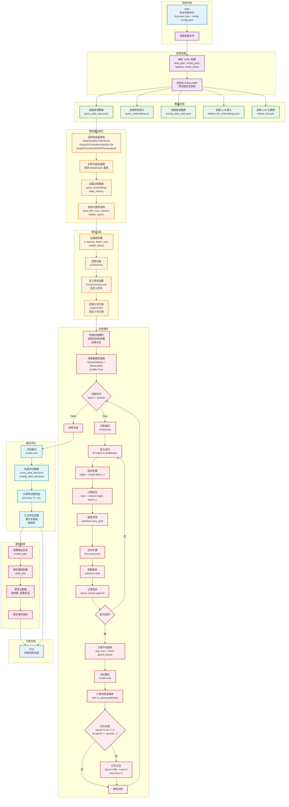

# LLMRouter 训练流程图

## 流程说明

训练流程将准备好的数据用于训练路由器模型，使其能够智能选择最合适的 LLM。

## 关键步骤说明

### 1. 配置加载
解析 YAML 配置文件，获取以下配置：
- **data_path**: 数据文件路径
- **model_path**: 模型保存路径
- **hparam**: 超参数（学习率、批次大小、轮次等）
- **router_name**: 路由器类型

### 2. 数据加载
加载训练所需的所有数据：
- `query_data_train.jsonl`: 训练集查询数据
- `query_embeddings.pt`: 查询嵌入向量
- `routing_data_train.jsonl`: 路由标签数据
- `default_llm_embeddings.json`: LLM 嵌入
- `default_llm.json`: LLM 元数据

### 3. 路由器初始化
根据配置选择并实例化路由器：
- **单轮路由器**: KNN, SVM, MLP, MF, ELO, RouterDC, AutoMix, HybridLLM, Graph, CausalLM
- **多轮路由器**: Router-R1
- **个性化路由器**: GMT, Personalized
- **代理路由器**: KNN Multi-Round, LLM Multi-Round

### 4. 模型设置
配置训练环境和模型参数：
- **设备选择**: CUDA（如可用）或 CPU
- **损失函数**: CrossEntropyLoss 或自定义损失
- **优化器**: Adam、SGD 或自定义优化器
- **超参数**: 学习率、批次大小、权重衰减等

### 5. 训练循环
执行模型训练：
1. **前向传播**: 计算模型输出
2. **损失计算**: 计算预测与真实标签的损失
3. **梯度清零**: 清空历史梯度
4. **反向传播**: 计算梯度
5. **参数更新**: 根据梯度更新模型参数

定期打印训练进度和性能指标。

### 6. 模型评估
在测试集上评估模型性能：
- 加载测试数据
- 计算准确率等指标
- 按任务类别和模型汇总结果

### 7. 模型保存
保存训练好的模型：
- 保存模型权重（state_dict）
- 保存元数据和配置
- 验证保存成功

## 支持的路由器类型

| 路由器类型 | 说明 | 特点 |
|-----------|------|------|
| KNN | K-近邻路由 | 基于相似度选择 |
| SVM | 支持向量机 | 分类边界清晰 |
| MLP | 多层感知机 | 深度神经网络 |
| MF | 矩阵分解 | 潜在特征学习 |
| ELO | ELO 评分 | 动态性能评估 |
| RouterDC | 双对比学习 | 对比学习优化 |
| AutoMix | 自动模型混合 | 模型组合策略 |
| HybridLLM | 混合 LLM 路由 | 结合多种策略 |
| Graph | 图神经网络 | 图结构建模 |
| CausalLM | 因果语言模型 | 因果关系建模 |
| GMT | 图多任务个性化 | 多任务学习 |
| Personalized | 个性化路由 | 用户偏好建模 |

## 训练输出

- 模型权重文件（`.pkl` 或 `.pt`）
- 训练日志
- 评估结果报告